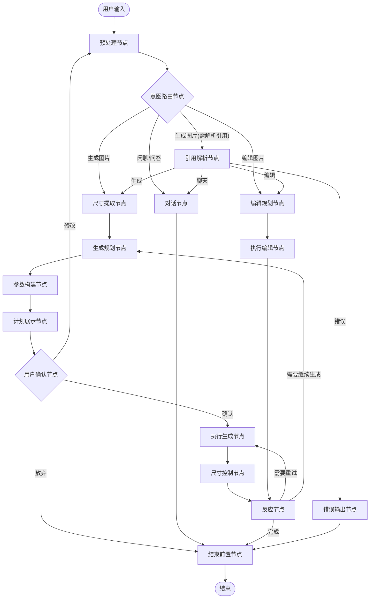
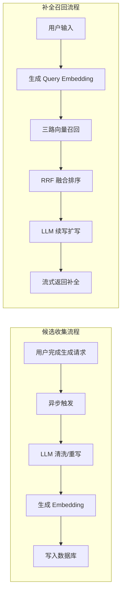

# 淘天AI设计师智能体

# AI Designer Agent 技术架构文档

本文档详细介绍了 AI Designer Agent 的技术架构、核心逻辑与工作流设计。该系统基于 `LangGraph` 构建，是一个具备意图识别、参数规划、多模态执行与状态管理能力的智能代理。

## 1. 系统概览

AI Designer Agent 是一个基于图（Graph-based）结构的对话式智能体，旨在处理复杂的图像生成与编辑任务。它不仅仅是一个简单的指令执行器，而是一个具备"思考-规划-确认-执行"闭环的智能系统。

### 核心能力

*   **多模态交互**：支持文本指令与图像输入的混合理解。
    
*   **智能路由**：根据用户意图自动分发任务（聊天、生图、修图）。
    
*   **上下文感知**：支持多轮对话，能够理解代词（如"这张图"、"上一张"）并解析对应的历史资源。
    
*   **参数自适应**：自动推断最佳图片尺寸、增强提示词、选择合适的底层模型。
    
*   **用户确认闭环**：在执行生成前展示计划，支持用户确认、修改或放弃。
    
*   **智能补全**：基于 RAG 的提示词自动补全，学习用户历史输入模式。
    

---

## 2. 架构设计 (Architecture)

系统采用有向循环图（Directed Cyclic Graph）架构，由节点（Nodes）和边（Edges）组成。所有的状态流转都通过全局上下文进行管理。

### 2.1 核心状态图 (State Graph)

以下是 Agent 的核心工作流：



### 2.2 状态管理 (State Management)

系统使用全局上下文在各个节点间传递数据，确保信息在多轮对话中保持一致。

| 字段类别 | 描述 |
| --- | --- |
| **对话历史** | 系统的对话历史，包含用户输入、AI 回复以及工具调用记录。 |
| **资源列表** | 全局资源表，记录生成的图片URL及其元数据。 |
| **用户输入** | 当前轮次的用户原始输入信息。 |
| **路由决策** | 记录当前任务的类型（生成、编辑或聊天）。 |
| **规划参数** | 规划阶段选定的底层模型、工具及参数配置。 |
| **生成计划** | 完整的图像生成计划，包含模型、提示词、尺寸等参数。 |
| **提示词** | 经过清洗、标准化和增强后的提示词。 |
| **目标引用** | 解析出的目标图片指针，用于指示需要基于哪张图片进行操作。 |
| **用户意图** | 用户对计划的响应意图：continue(确认)、reconstruct(修改)、abandon(放弃)。 |
| **尺寸信息** | 用户指定或 AI 推断的图像宽高。 |
| **缓存数据** | 用于加速重复请求或回溯参数的缓存信息。 |

---

## 3. 核心模块详解

### 3.1 意图识别与路由 (Action Router)

*   **功能**: 作为系统的大脑，分析用户输入的语义。
    
*   **逻辑**:
    
    1.  接收用户输入和最近的对话上下文。
        
    2.  调用大语言模型 (LLM) 输出结构化决策数据。
        
    3.  **决策输出**:
        
        *   **任务类型**: 决定后续是进入生成、编辑还是聊天流程。
            
        *   **引用解析需求**: 判断用户是否使用了模糊代词（如"把它变大点"），如果是，则触发引用解析流程。
            
        *   **思考链**: 生成一段对用户友好的简短思考/响应文本。
            

### 3.2 引用解析 (Image Reference Resolver)

*   **触发条件**: 当路由判断需要解析用户指代的图片时触发。
    
*   **功能**: 解决多轮对话中的指代消歧问题。
    
*   **逻辑**:
    
    *   **构建上下文**: 从全局资源表中提取历史图片的"虚拟指针"和对应的指令摘要（如 `[img_0]: 一只猫`），而不是直接使用 URL。
        
    *   **语义匹配**: 分析用户的模糊指代（"第一张"、"上一张"、"它"），将其映射到具体的指针 ID。
        
    *   **输出**: 生成 `chosen_assets_pointers` 列表，将逻辑引用传递给后续节点。
        

### 3.3 尺寸提取节点 (Extract Size From Input)

*   **功能**: 从用户输入中智能提取尺寸信息。
    
*   **逻辑**:
    
    *   解析用户明确指定的尺寸（如"1920x1080"、"横屏"、"竖版"）。
        
    *   将语义描述转换为具体像素值。
        
    *   如果用户未指定，保留为空，交由后续节点自动推断。
        

### 3.4 任务规划 (Planners)

系统包含生成规划器和编辑规划器。

*   **功能**: 将用户的自然语言转化为机器可执行的参数配置。
    
*   **主要产出**:
    
    *   **模型选择**: 选择最适合的底层模型（例如：选择高质量绘图模型或快速生成模型）。
        
    *   **提示词处理**: 提取核心画面描述，去除无意义的语气词。
        
    *   **生成模式**: 确定是文生图(t2i)还是图生图(i2i)，是否需要自定义尺寸。
        
    *   **工具选择**: (针对编辑任务) 选择具体的工具（如去除背景、扩图、超分等）。
        

### 3.5 参数构建节点 (Construct Image Params)

*   **功能**: 将规划结果转化为完整的、可执行的生成计划。
    
*   **核心逻辑**:
    
    1.  **参数清洗与推断**:
        
        *   **尺寸推断**: 如果用户未指定尺寸，系统会根据画面内容自动推断最佳比例（如"全身照"自动推荐竖图，"风景"自动推荐横图）。
            
        *   **智能缩放**: 确保分辨率在模型支持的最佳范围内（1024-4096），进行智能等比缩放。
            
    2.  **Prompt 增强**: 当用户提示词过短（<30字）且配置开启时，自动调用增强模块进行扩写，增加光影、风格、细节等描述。
        
    3.  **多 Prompt 并发增强**: 文生图场景下，为 seedream 模型并发生成 4 个增强后的 prompt，用于生成多张候选图。
        
    4.  **图生图兜底**: 自动处理参考图 URL 的获取和兜底。
        

### 3.6 用户确认闭环 (Plan Confirmation & Check Response)

*   **计划展示节点**: 将生成计划以用户友好的方式展示，包括模型、尺寸、增强后的提示词等。
    
*   **用户确认节点**:
    
    *   使用 `interrupt` 机制暂停执行，等待用户反馈。
        
    *   支持三种用户意图：
        
        *   **continue**: 确认执行当前计划。
            
        *   **reconstruct**: 用户有修改意见，重新进入规划流程。
            
        *   **abandon**: 用户放弃本次生成。
            
    *   支持 `skip_confirmation` 参数跳过确认环节（默认跳过）。
        

### 3.7 执行引擎 (Execution Engine)

#### 图像生成节点

负责实际调用底层模型 API 进行图像生成。

1.  **并发控制**:
    
    *   支持智能并发模式，可同时生成多张图片供用户选择。
        
    *   根据配置动态调度底层计算资源。
        
2.  **流式输出**:
    
    *   实时推送进度和状态更新给前端，提供良好的交互体验。
        

#### 尺寸控制节点 (Size Control)

*   在生成后检查是否需要进行尺寸调整（如用户指定的尺寸与模型输出不一致）。
    
*   处理等比缩放和裁剪逻辑。
    

#### 图像处理节点

负责对已有图片进行编辑。

*   根据规划器选定的具体工具（如扩图、抠图）调用对应的处理服务。
    
*   依赖引用解析模块准确锁定需要编辑的源图片。
    

### 3.8 反应节点 (React Node)

*   **功能**: 评估执行结果，决定后续行为。
    
*   **决策逻辑**:
    
    *   检查生成结果质量和数量。
        
    *   判断是否需要重试（如生成失败）。
        
    *   判断是否需要继续生成（如用户要求多张但当前数量不足）。
        
    *   正常情况下进入结束流程。
        

---

## 4. 智能补全系统 (Autocomplete System)

系统实现了一套基于 RAG 的智能提示词补全功能，包含候选收集和召回扩写两个核心模块。

### 4.1 系统架构



### 4.2 候选收集服务 (Autocomplete Candidate Service)

当用户成功完成一次图像生成请求后，系统会异步提取和保存可复用的提示词片段。

#### 处理流程

1.  **文本清洗**: 调用 `qwen-plus` 将用户的口语化输入重写为规范、简洁的补全文本。
    
2.  **长文本切块**: 超过 150 字的文本按语义停顿符号切分为 20-60 字的块。
    
3.  **Embedding 生成**: 使用 `text-embedding-v4` 生成 1024 维向量。
    
4.  **质量评分**: 基于规则计算质量分（0-100），考虑文本长度等因素。
    
5.  **去重入库**: 通过 `norm_hash` + `UNIQUE INDEX` + `ON CONFLICT` 实现去重写入。
    

#### 清洗规则示例

```plaintext
输入: "背景干净一点，显得高级，不要太花，商品突出"
输出: "背景简洁，高级感风格，商品主体突出"

输入: "写实风格的产品图，柔和自然光，白色背景"
输出: "写实风格，柔和自然光，白色背景，产品图"

```

#### 设计原则

*   **异步执行**: 完全异步，不阻塞用户请求响应。
    
*   **失败容忍**: 清洗/写入失败只记录日志，不影响主流程。
    
*   **版本管理**: 通过 `pipeline_version` 字段追踪数据来源和迭代。
    

### 4.3 RAG 召回与扩写服务 (Autocomplete RAG Service)

当用户在输入框输入时，系统实时召回相关的历史优质提示词，并生成续写补全。

#### 三路召回策略

| 召回路径 | 权重 | 描述 |
| --- | --- | --- |
| **Session 路** | 0.5 | 同 session\_id 的候选，上下文相关性最强 |
| **User 路** | 0.3 | 同 user\_id 但不同 session 的候选，跨会话的个性化偏好 |
| **全局路** | 0.2 | 其他用户的候选，覆盖面广，避免数据稀疏 |

#### RRF 融合算法

使用 Reciprocal Rank Fusion 算法融合三路结果：

```plaintext
RRF_score(d) = Σ weight_i / (k + rank_i)

```

其中 `k=60` 为 RRF 常数，`weight_i` 为各路权重。

#### 综合排序

最终排序使用复合得分：

```plaintext
final_score = 0.7 * similarity + 0.3 * (quality_score / 100)

```

#### LLM 续写

召回的候选作为参考上下文，由 `qwen-flash`（极速模型）生成续写增量，确保：

*   续写内容能与用户输入自然拼接。
    
*   添加适当的场景、光影、构图、氛围等细节。
    
*   控制续写在 20-80 字之间。
    

### 4.4 数据库表结构

```sql
CREATE TABLE autocomplete_candidate (
    candidate_id BIGSERIAL PRIMARY KEY,
    user_id TEXT NOT NULL,
    session_id TEXT NOT NULL,
    biz_type TEXT DEFAULT 'agent',
    candidate_type TEXT NOT NULL DEFAULT 'tag',
    text TEXT NOT NULL,
    embedding vector(1024) NULL,
    quality_score SMALLINT NOT NULL DEFAULT 50,
    is_active BOOLEAN NOT NULL DEFAULT TRUE,
    seen_count INTEGER NOT NULL DEFAULT 0,
    accept_count INTEGER NOT NULL DEFAULT 0,
    norm_hash TEXT NOT NULL,
    pipeline_version TEXT NOT NULL DEFAULT 'v1',
    created_at TIMESTAMP NOT NULL DEFAULT NOW(),
    updated_at TIMESTAMP NOT NULL DEFAULT NOW()
);

-- 去重索引
CREATE UNIQUE INDEX uq_autocomplete_candidate_dedup
ON autocomplete_candidate (COALESCE(biz_type, ''), candidate_type, norm_hash);

-- 向量索引（HNSW + cosine）
CREATE INDEX idx_autocomplete_candidate_embedding_hnsw
ON autocomplete_candidate USING hnsw (embedding vector_cosine_ops);

```
---

## 5. 关键技术特性

### 5.1 智能缓存 (Caching Strategy)

系统维护了一套智能缓存机制。

*   **命中逻辑**: 如果用户的输入内容与上一次完全一致，且未强制重试，系统会**复用上一次生成的参数配置**（如优化后的提示词、模型参数等）**重新调用生成服务**，而不是直接返回缓存的图片结果。
    
*   **优势**: 避免重复进行参数规划与提示词优化，降低处理延迟，同时利用生成模型的随机性，让用户在相同指令下获得不同的创作结果。
    

### 5.2 鲁棒性设计

*   **重试机制**: 所有核心节点都配置了自动重试策略（`RetryPolicy`），在 API 调用超时或偶发失败时自动恢复。
    
*   **兜底逻辑**:
    
    *   当引用解析不明确时，有默认的兜底策略（如默认指向最新生成的图片）。
        
    *   当模型调用异常时，有完整的错误检测和反馈流程。
        
    *   独立的错误输出节点处理异常情况。
        
*   **并发锁机制**: 使用 PostgreSQL Advisory Lock 确保同一会话不会并发执行多个任务。
    

### 5.3 提示词工程 (Prompt Engineering)

系统内置了提示词增强模块。

*   **原理**: 使用大模型将简短的用户指令扩写为包含光影、风格、构图详细描述的英文 Prompt，从而显著提升生成质量。
    
*   **并发增强**: 文生图场景下，支持并发生成多个差异化的增强 prompt。
    

### 5.4 虚拟指针系统 (Virtual Pointer System)

为了高效且安全地管理多轮对话中的媒体资源，系统设计了一套独特的"虚拟指针"机制。

*   **生成原理**: 每次生成或上传图片时，系统会为其分配一个唯一的逻辑 ID（如 `task_123_img0`），该 ID 与图片的物理 URL、尺寸等元数据在内部进行绑定。
    
*   **Token 优化**: 在与 LLM 交互时，系统仅提供简短的指针 ID 和指令摘要。这避免了将冗长的 URL 填入上下文，显著降低了 Token 消耗，同时防止了因 URL 格式复杂导致的模型幻觉。
    
*   **双向映射流程**:
    
    1.  **正向解析**: 用户指令（"修改这张图"） -> 引用解析器 -> 输出指针 ID (`task_xxx`)。
        
    2.  **反向还原**: 执行节点接收指针 ID -> 查询资源表 (`assets_list`) -> 还原为真实 URL 和尺寸参数 -> 调用底层图像服务。
        

---

## 6. 项目结构

```plaintext
src/agent/
├── graph.py                    # Agent 图定义与编译
├── config.json                 # 配置文件
├── prompt_config.json          # 提示词配置
├── nodes/                      # 节点实现
│   ├── before_end.py           # 结束前置节点
│   ├── chat_node.py            # 对话节点
│   ├── check_user_response.py  # 用户确认检查
│   ├── conditional_edge.py     # 条件边逻辑
│   ├── construct_image_params.py # 参数构建节点
│   ├── error_output_node.py    # 错误输出节点
│   ├── extract_size_from_input_node.py # 尺寸提取节点
│   ├── image_generate_node.py  # 图像生成节点
│   ├── image_process_node.py   # 图像处理节点
│   ├── output_plan_confirmation.py # 计划展示节点
│   ├── react_node.py           # 反应节点
│   ├── size_control_node.py    # 尺寸控制节点
│   └── sub_routers/            # 子路由器
│       ├── action_router.py    # 意图路由
│       ├── before_action_router.py # 预处理路由
│       ├── image_generate_planner.py # 生成规划器
│       ├── image_process_planner.py  # 编辑规划器
│       └── image_reference_resolver.py # 引用解析器
├── services/                   # 服务模块
│   ├── autocomplete_candidate_service.py # 候选收集服务
│   └── autocomplete_rag.py     # RAG 召回与扩写服务
├── tools/                      # 工具集
│   ├── enhance_prompt.py       # 提示词增强
│   ├── run_seedream_worker.py  # Seedream 模型调用
│   ├── run_nano_banana_worker.py # Nano Banana 模型调用
│   └── ...
└── utils/                      # 工具函数
    ├── state.py                # 状态定义
    ├── assets_utils.py         # 资源管理
    ├── auto_size.py            # 自动尺寸推断
    ├── embedding.py            # Embedding 工具
    └── ...

```
---

## 7. 数据流示例 (Example Walkthrough)

### 示例 1: 新建图像生成

**用户输入**: "帮我画一只赛博朋克风格的猫"

1.  **预处理**: 初始化对话状态。
    
2.  **意图路由**:
    
    *   识别意图为"图像生成"。
        
    *   判断无模糊指代，无需引用解析。
        
    *   生成响应："好的，我来为您创作一只赛博朋克风格的猫咪。"
        
3.  **尺寸提取**: 用户未指定尺寸，保留为空。
    
4.  **生成规划**:
    
    *   提取核心描述: "赛博朋克风格的猫"。
        
    *   选择 seedream 模型。
        
    *   确定生成模式: smart\_t2i（智能尺寸文生图）。
        
5.  **参数构建**:
    
    *   **尺寸推断**: 通过 AI 分析判断适合方图，设置 1024x1024。
        
    *   **Prompt 增强**: 并发生成 4 个增强版 prompt。
        
6.  **计划展示**: 展示生成计划（如跳过确认则直接执行）。
    
7.  **执行生成**:
    
    *   并发调用 seedream 生成 4 张图片。
        
    *   实时推送进度。
        
8.  **尺寸控制**: 检查输出尺寸，无需调整。
    
9.  **反应节点**: 生成成功，进入结束流程。
    
10.  **结果反馈**: 更新系统状态，返回图片。
    
11.  **异步补全候选收集**: 提取"赛博朋克风格，猫咪"作为候选存入数据库。
    

---

### 示例 2: 基于引用的图像编辑

**用户输入**: "把它变成横屏的" (接上文)

1.  **意图路由**:
    
    *   识别意图为"图像编辑" (因为涉及修改)。
        
    *   判断需要引用解析 (因为使用了代词"它")。
        
2.  **引用解析**:
    
    *   解析"它"指的是上一轮生成的"赛博朋克猫"。
        
    *   锁定对应的图片资源指针。
        
3.  **编辑规划**:
    
    *   识别操作类型: 扩图 (Outpaint)。
        
    *   计算目标参数: 设置为横屏比例。
        
4.  **执行编辑**:
    
    *   调用扩图服务对锁定的图片进行处理。
        
5.  **反应节点**: 处理成功。
    
6.  **最终输出**: 返回扩图后的结果。
    

---

### 示例 3: 自动补全流程

**用户正在输入**: "一只猫在"

1.  **触发自动补全**: 前端检测到用户停顿，调用 `/autocomplete` API。
    
2.  **Embedding 生成**: 将用户输入转换为向量。
    
3.  **三路召回**:
    
    *   Session 路: 找到本次会话中的"赛博朋克风格，猫咪"。
        
    *   User 路: 找到该用户历史的"写实风格，自然光"。
        
    *   全局路: 找到热门的"慵懒姿态，温暖阳光"。
        
4.  **RRF 融合**: 按权重融合排序。
    
5.  **LLM 续写**: 基于召回的参考，生成续写"阳光照射的窗台上慵懒地打盹，金色光芒洒落"。
    
6.  **流式返回**: 逐字符推送给前端展示。
    

**最终补全结果**: "一只猫在阳光照射的窗台上慵懒地打盹，金色光芒洒落"

---

## 8. 用户体验优化 (UX Design)

为了缓解用户在等待复杂生成任务时的焦虑感，系统设计了一套细粒度的实时反馈机制。

*   **实时状态流 (Real-time Feedback Stream)**: 系统不仅仅在任务全部完成后才返回结果，而是在处理的每个关键阶段（如"正在解析意图"、"正在规划参数"、"开始绘制"、"生成完成"）都会实时推送用户友好的状态更新。
    
*   **思考链展示 (Thought Process)**: 在不暴露底层技术细节（如具体的 JSON 参数）的前提下，系统会以自然语言展示 Agent 的"思考过程"（例如："我正在为您构思画面细节..."、"正在对图片进行扩充处理..."），让用户感知到智能体的即时响应。
    
*   **智能补全 (Smart Autocomplete)**: 在用户输入时提供实时的提示词补全建议，基于用户历史和全局热门内容，帮助用户快速构建高质量的提示词。
    

---

## 9. API 接口

### 核心接口

| 接口 | 方法 | 描述 |
| --- | --- | --- |
| `/chat` | POST | Agent 主对话接口，SSE 流式响应 |
| `/get-task-result` | GET | 获取任务最终结果（轮询） |
| `/get-state` | GET | 查看会话状态 |
| `/autocomplete` | GET | 提示词自动补全，SSE 流式响应 |
| `/autocomplete/extract` | POST | 手动触发候选提取（测试用） |

### 自动补全接口参数

```plaintext
GET /autocomplete?input=一只猫在&empId=user123&sessionId=session456

```

| 参数 | 类型 | 描述 |
| --- | --- | --- |
| `input` | string | 用户当前输入的文本 |
| `empId` | string | 用户ID，用于个性化召回 |
| `sessionId` | string | 会话ID，用于上下文相关召回 |