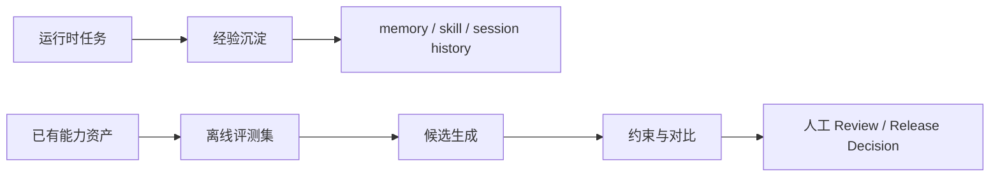

# Hermes 离线自进化：把 Agent 能力资产放进可验证的优化流水线

> **核心观点**：离线自进化不是自动发布，而是把候选版本、证据和风险交给审查流程。先定义比较面，再生成候选；先过滤风险，再留下证据；最后由人决定是否发布。

## 一、离线自进化要解决什么问题

当 Agent 的能力越来越多地沉淀在模型外部，`SKILL.md`、工具描述和代码实现就不再只是"写给模型看的说明"，而是一组会影响任务结果的能力资产。

问题来了：**如何系统化地改进这些能力资产？**

"自进化"这个词很容易把两个不同问题混在一起：

运行时自进化关心的是"发生过的事情如何成为未来上下文"。它让用户偏好、项目约束、失败经验和可复用流程，有机会在未来任务中被重新使用。它有真实环境作为天然约束——失败了用户会抱怨，成功了会有正反馈。

离线自进化关心的是另一件事。它不让 Agent 在当前对话里即时改写自己，而是把一个既有 Skill、Prompt 或 Tool Description 放进离线实验链路里：构造评测任务，生成候选版本，对比 baseline 与 candidate，检查约束，保存证据，最后由人决定是否采用。**它没有真实环境的天然反馈，所以需要人工构造评测、约束和审查。**

两者不冲突——运行时自进化让系统从真实使用中留下经验，；离线自进化让能力资产进入实验、评测和发布纪律，离线进化的结果也可以通过人工审查后进入运行时。



## 二、为什么从 Skill Body 开始

Hermes 的长期设想里，可优化对象不止一种。它可以优化 skill，也可以优化工具描述、系统提示词，甚至代码实现。但这些对象的影响面和评测方式并不一样：

| **Phase** | **Target** | **Engine** | **Status** |
| --- | --- | --- | --- |
| **Phase 1** | Skill files (SKILL.md) | DSPy + GEPA | ✅ Implemented |
| **Phase 2** | Tool descriptions | DSPy + GEPA | 🔲 Planned |
| **Phase 3** | System prompt sections | DSPy + GEPA | 🔲 Planned |
| **Phase 4** | Tool implementation code | Darwinian Evolver | 🔲 Planned |
| **Phase 5** | Continuous improvement loop | Automated pipeline | 🔲 Planned |

当前 Hermes Agent Self-Evolution 中最具体、最可核实的是 Phase 1：Skill files。

选择 Skill 作为开始是一个务实切入点。`SKILL.md` 通常包含某类任务的触发条件、执行步骤、注意事项和验证方式。它不是普通文档，而是一段会直接影响 Agent 行为的程序性文本。

相比 system prompt，Skill 的影响面更局部。相比代码实现，它更容易做回滚和离线对照。也正因为边界更窄，评测更容易定义，候选更容易审查，失败时也更容易回到 baseline。

但是实际上Hermes一阶段迭代的是Skill的`body`部分，源码里会把 skill 文件拆成 `frontmatter` 和 `body`；将`body`放入进化流水线中，最终的Skill会保留原始的`frontmatter`只替换 `evolved body`。

```plain text
SKILL.md
├── frontmatter: name / description / metadata  保留
└── body: 具体流程说明                            优化
```

**这一步的意义，是把问题从"重写一个能力"收敛成"在同一个 skill 身份下，寻找更好的程序性说明文本"。**

**为什么 frontmatter 没有进入本轮优化**

没有把 `frontmatter` 一起放进本轮优化，并不是因为它不重要，而是因为它承担的是另一类职责。

`name` 和 `metadata` 定义了 skill 的身份边界。`description` 则会影响 Agent 什么时候发现、选择和触发这个 skill。

因此，`description` 的定位更接近 tool description。它的优化目标不是"skill 被调用之后任务做得更好"，而是"该调用时能被召回，不该调用时不要误触发"。

这类迭代更适合放在路由级评测里，用正例、负例、相似任务干扰、误触发率和漏触发率来验证，而不是和 skill body 共用同一套任务级执行评测。

## 三、评测闭环——定义什么叫变好

**离线优化最先要回答的问题，不是用什么 optimizer，而是定义什么叫变好。**

对 Skill Body Evolution 来说，"变好"不是 skill 文本读起来更顺，而是它被调用后，能不能在一组任务上更稳定地触发正确流程、覆盖关键检查点，并避免已知失败模式。

当前实现里，评测样本统一表示为 `EvalExample`：

| 字段 | 含义 |
| --- | --- |
| `task_input` | 用户可能提出的任务 |
| `expected_behavior` | 期望行为，也就是评分规约：一个好输出应该满足哪些点 |
| `difficulty` | easy / medium / hard |
| `category` | 样本类别 |
| `source` | synthetic / sessiondb / golden |

这里最关键的是 `expected_behavior`，更像评分规约，而不是标准答案。

例如，一个 评测样本可以长这样：

```json
{
  "task_input": "我有一个全链路 traceId: tr-xyz789。请分析这次请求中价格计算模块的详细逻辑，以及为什么最终支付金额与展示金额有1分钱差异。",
  "expected_behavior": "1. 用户明确提供了 wholeTraceId，构成可执行 runtime anchor。2. 技能应进入完整工作流：使用 tracelog export 导出该 trace 的全链路日志。3. 分析日志，定位价格计算相关服务，确认运行态事实（如各服务返回的金额、使用的规则）。4. 结合代码/配置分析，解释差异原因（如精度、四舍五入规则）。5. 输出应结构化，结论先行，明确区分 runtime_confirmed（如日志显示金额）和 static_inferred（如代码中的精度处理逻辑）。",
  "difficulty": "medium",
  "category": "workflow-execution",
  "source": "synthetic"
}
```

这个样本的重点不是要求模型复现某段标准答案，而是规定一个合格回答必须满足哪些行为。

### 3.1 样本来源：从冷启动到发布门禁

当前代码中定义了三类数据入口：

| 来源 | 作用 | 适合阶段 |
| --- | --- | --- |
| synthetic | 让强模型读取 skill 后生成任务和评分规约 | 冷启动、跑通链路 |
| sessiondb | 从 Claude Code、Copilot、Hermes 历史中抽取真实任务，再生成或规范化评测样本 | 贴近真实使用分布 |
| golden | 人工维护 JSONL | 回归门禁、发布判断 |

这三类来源不是平级替代关系，而是对应不同成熟度的评测需求。

`synthetic` 适合冷启动。它能帮助我们快速验证优化流程是否能跑通，但不能直接作为生产发布证据。

`sessiondb` 适合引入真实使用分布。当前实现会从本机多种 AI 工具历史中抽取候选任务，并做相关性筛选、字段规范化和 train/val/holdout 切分。但真实历史也不能直接替代人工 golden set，因为历史任务可能带有噪声、隐私、偏差和缺失上下文。

`golden` 承担回归和发布判断。它应该由人维护，覆盖高频任务、关键失败模式、边界场景和历史回归点。

默认配置里，`eval_dataset_size` 是 20，切分比例大致是 train 50%、val 25%、holdout 25%。这个规模足够证明链路能跑，candidate 能被初步比较，但不能被写成生产级发布证据。**真正要发布，仍然需要稳定的 golden set、失败样本回灌和真实分布样本。**

### 3.2 评分信号：从轻量 proxy 到 LLM Judge

有了任务和评分规约，还需要一个 metric 把 Agent 输出转成优化器能使用的信号。当前 Hermes 的代码实现里有两种评分能力：

| 评分能力 | 当前作用 | 特点 | 边界 |
| --- | --- | --- | --- |
| `skill_fitness_metric()` | 默认主路径使用 | 输入为空给 0 分；否则先给基础分 0.3，再根据 `expected_behavior` 与 `agent_output` 的词重叠估分（基于中文分词后的 token 重叠率，使用集合交集/并集比计算），最高 1.0 | 快，但只是轻量 proxy——词重叠高不代表行为真的变好 |
| `LLMJudge` | 已实现的 LLM 裁判组件 | 拆成 `correctness`、`procedure_following`、`conciseness` 三个维度，并输出 `feedback` | 尚未作为 GEPA 默认优化信号接入 |

`LLMJudge` 的定位更接近真正的行为评估。它可以指出"漏了某个关键检查点""步骤顺序不对""回答过长但没有覆盖核心要求"这类可改进信号。

但按当前主链路，传给 GEPA 和 holdout 对比的仍是返回 float 的轻量 `skill_fitness_metric()`。`LLMJudge` 虽然能生成 `score + feedback`，但这份文本反馈还没有作为 GEPA 的默认优化信号接入。

这里需要特别标注：

> **当前可以说：Hermes 已经把 skill body 放进了评测驱动的优化框架。**
> **当前不能说：GEPA 已经基于 LLMJudge.feedback 做反思式搜索，并形成生产级发布判断。**

未来如果要让自然语言反馈真正成为优化信号，需要把能返回 `score + feedback` 的 metric 正式接入 GEPA，并在 artifact 中保留每个样本的输出、分数和反馈。

有了样本和评分，下一个问题是：一个静态 Markdown 文件怎么被评分函数"调用"？

### 3.3 评测基础设施：SkillModule

优化器不能直接比较一个静态 Markdown 文件。它需要的是一个可调用对象：给定同一批任务，让不同版本的 skill body 产生输出，再把输出交给同一个 metric 打分。

`SkillModule` 承担的就是这层转换。

```plain text
skill_instructions + task_input -> output
```

当前 skill body 会作为 `skill_instructions`，评测任务会作为 `task_input`，二者一起交给 `dspy.ChainOfThought`（DSPy 框架中的思维链模块，负责根据指令和输入生成结构化响应）生成响应。DSPy 是一个声明式语言模型编程框架，它把 prompt 优化问题转化成可调参的模块组合。

也可以把它压成一个函数：

```plain text
SkillModule(skill_body)(task_input) -> agent_output
```

这个转换让一个原本只能被人阅读的 `SKILL.md`，变成了可调用、可评分、可对照的实验对象。只要固定任务集和 metric，就可以比较 baseline body 和 candidate body 在同一批任务上的表现差异。

不过，这里也有一条边界必须说清楚。

**SkillModule 能证明说明文本如何影响离线任务输出，但不能证明完整 Hermes runtime 在真实环境里一定表现更好。**

真实 runtime 里还有文件系统副作用、多轮工具调用、外部权限、网络环境、上下文压缩、用户插话、失败恢复等因素。Phase 1 当前比较的是离线 proxy，不是生产行为证明。

## 四、优化器生成候选

**优化器的角色是生成候选，不是宣布胜利。**

有了可评测的 SkillModule，优化器就可以在 train/val 样本和 metric 的约束下，尝试寻找一个表现更好的 candidate body。

```plain text
baseline module + train/val examples + metric
        ↓
GEPA / MIPROv2
        ↓
candidate module
```

在 Hermes 当前封装里，默认候选生成器是 GEPA（Generalized Evolutionary Prompt Adaptation）。从设计意图看，它是一个基于进化的 prompt 优化框架——类似遗传算法，通过评估候选版本在评测样本上的表现，迭代地生成、变异和筛选新的候选版本。如果 `dspy.GEPA` 不可用，会 fallback 到 `dspy.MIPROv2`——这是一个基于贝叶斯优化的 prompt 搜索方法，通过构建目标函数的代理模型来指导搜索。

但在当前 Hermes 主流程里，明确接入的是样本表现和 float 分数，而不是自然语言反馈。前面提到的 `LLMJudge` 已经存在，但没有成为默认优化信号，这意味着 GEPA 在实际运行中降级为只用分数，它和 MIPROv2 的核心差异在当前实现中被缩小了——两者都在 float 分数约束下搜索，只是搜索策略不同（进化 vs 贝叶斯）。

并且优化器在这条链路里只负责候选生成，不负责发布判断。分数更高的 candidate 仍然可能变得过长、偏离原始目的、破坏结构，或者只是迎合了轻量 proxy metric。

## 五、约束、Holdout 与发布决策

**通过优化器生成的高分 candidate 不能直接发布。它最多说明候选版本在当前 metric 下表现更好，但不代表它已经安全、稳定，也不代表它适合进入主仓库。**

候选版本至少要经过三道关：先用约束门禁挡掉明显坏候选，再用 holdout 看未参与优化的样本，最后由人审查候选、分数和 diff 后做出发布决策。

### 5.1 约束门禁：先挡掉明显坏候选

当前 `ConstraintValidator` 已经实现了几类基础约束：

| 约束 | 当前行为 | 挡住的问题 |
| --- | --- | --- |
| `size_limit` | skill body 默认不超过 15KB | 候选文本过长 |
| `growth_limit` | 相比 baseline 默认最多增长 20% | 候选相对 baseline 膨胀过多 |
| `non_empty` | 不能是空文本 | 优化结果退化为空 |
| `skill_structure` | 检查文本是否看起来像完整 skill 文件：以 `---` 开头，且前 500 字包含 `name:` 和 `description:` | 最终产物丢掉基本身份信息 |

基础 gate 至少能挡住最明显的坏候选。Prompt 或 skill 优化常见坏结果包括变长、堆关键词、改空、丢结构、偏离原始目的。

但这些约束也有明显盲点。`growth_limit` 只限制膨胀，不限制收缩——一个 candidate 相比 baseline 缩减 50% 仍然会通过，因为"缩减"不是"增长"。但大幅缩减往往意味着优化器过于激进地删除了内容，这正是第六节案例中体现的。

**当前 skill_structure 校验和 body 优化边界并不完全一致**

源码里的 `_check_skill_structure()` 只做三件事：

```python

```

设计上，完整 skill 文件发布前确实需要保留 `name/description` 等身份元信息，避免候选文本丢掉 skill 的基本结构。

但当前 Phase 1 的优化对象是 skill body。`load_skill()` 会拆出 frontmatter/body，`SkillModule(skill["body"])` 运行时只使用 body，`reassemble_skill()` 又会保留原始 frontmatter、只替换 evolved body。

因此真正的问题不是"候选 body 应该携带 frontmatter"，而是当前主流程在 baseline 和 evolved 约束校验时，把 `skill["body"]` 和 `evolved_body` 传给了 `validate_all(..., "skill")`。这样 body 会被当成完整 skill 文件来做 full-skill-like 检查，可能被误判为缺少结构。

更合理的下一步，是拆开两层约束：body 级约束检查 body 的非空、大小、增长和内容风险；完整 skill 结构检查则在 `reassemble_skill(frontmatter, evolved_body)` 之后，对 reassembled full skill 执行。

### 5.2 Holdout：再看未参与优化的样本

如果 candidate 通过约束，主流程会在 holdout 集上分别运行 baseline module 和 optimized module，然后计算平均分：

```plain text
avg_baseline = mean(baseline_scores)
avg_evolved = mean(evolved_scores)
improvement = avg_evolved - avg_baseline
```

holdout 的意义是降低"熟题幻觉"。train 和 val 已经参与优化，candidate 可能只是在这些样本上变好。holdout 是最后才拿出来的样本，用来观察候选版本在未参与优化的数据上是否仍然优于 baseline。

但 holdout 也不是生产证明。尤其在默认样本规模较小、评分函数仍是轻量 proxy 的情况下，它只能说明 candidate 在当前离线评测面上有初步优势，不能直接证明完整 Hermes runtime 在真实任务里一定更好。

### 5.3 Artifact 与发布决策：把候选变成可审查证据包

通过约束和 holdout 后，当前实现会输出三类核心产物：

| 产物 | 作用 |
| --- | --- |
| `baseline_skill.md` | 原始 skill 完整内容，对照组 |
| `evolved_skill.md` | 候选 skill 完整内容 |
| `metrics.json` | skill 名称、timestamp、模型、迭代次数、分数、样本数、耗时、size、约束结果 |

这组 artifact 的意义，是把"改 skill"变成一次可审查实验。人可以看 diff，也可以看 metrics；失败时，可以用 baseline 做回退参照；未来如果记录逐样本输出和反馈，某些 holdout 失败样本还可以进入下一轮 golden set。

但 artifact 输出仍然不等于 release。当前链路最多产出候选版本和证据包，不包含自动发布到生产的动作。是否把 `evolved_skill.md` 合入主仓库、是否进入生产使用，仍然依赖人工 review、PR/merge 和回退策略。

一个稳妥的 release decision 至少要看这些维度：diff 是否可解释，holdout 是否相对 baseline 提升，失败样本是否可接受，size/growth/structure 是否通过，tests/benchmark 是否没有回归，是否仍然保持 skill 的原始目的，以及是否可以明确回到 baseline。

**离线自进化不是把"看起来更好"的文本自动写进主仓库，而是把候选版本、证据和风险交给审查流程。**

---

以上五节拆解了离线自进化的完整链路：从"优化什么"（第二节）到"怎么评测"（第三节），再到"怎么搜索"（第四节）、"怎么过滤和决策"（第五节）。每一环节都试图回答同一个问题：**这一步的信号是否足以支撑自动决策？**

答案是：**当前还不足以支撑。** 评测用的是轻量 proxy，优化器只负责候选生成，约束门禁只能挡住明显坏候选，holdout 分数不能替代真实环境验证。离线进化没有运行时那种"失败即反馈"的天然约束，所以需要这些人工构造的环节来保证安全。

接下来，我用一个完整案例——online-logic-analysis 的进化过程——展示这条链路的实际运行。这个案例既有成功，也有失败，我希望它能让读者看到：离线进化能做什么，不能做什么，以及为什么最终决策仍然需要人工判断。

## 六、案例：online-logic-analysis 的进化全记录

### 6.1 问题：这个 skill 为什么需要进化

online-logic-analysis  的一个 skill，用于帮助用户梳理线上逻辑。原始版本有 16,297 bytes（约 16KB），包含以下内容：

```plain text
原始 skill 结构（16,297 bytes）
├── Overview：运行态证据优先的核心原则
├── Modes：standalone / embedded 两种模式说明
├── Non-negotiables：12 条硬约束规则
├── Hard Gate：可执行 runtime anchor 检查
├── Inputs：输入参数定义
├── Workflow：7 步工作流程
│   ├── Step 1: Normalize the request
│   ├── Step 2: Resolve appkey and knowledge routing
│   ├── Step 3: Prefer full-chain logs through tracelog
│   ├── Step 4: Group traces and requests
│   ├── Step 5: Build evidence and explanations
│   ├── Step 6: Render for the current consumer
│   └── Step 7: Refine and parallelize when needed
└── Reference Loading Guide：参考文档加载说明
```

### 6.2 实验：离线进化的完整链路

**评测准备**

首先，用 synthetic 方式生成了 21 个评测样本，覆盖高频任务、边界场景和已知失败模式。切分为 10 个 train、5 个 val、6 个 holdout。

评分函数使用 `skill_fitness_metric()`：输入为空给 0 分；否则先给基础分 0.3，再根据 `expected_behavior` 与 `agent_output` 的词重叠估分，最高 1.0。

**候选生成**

运行优化器（GEPA，5 轮迭代，耗时约 25 分钟），产出候选版本：

```plain text
baseline:  16,297 bytes（8,010 chars）
candidate:  6,789 bytes（5,708 chars）
精简比例:  -58.4%（bytes）/ -28.7%（chars）
```

> 注：bytes 与 chars 的比值取决于编码和内容语言。baseline 以中文为主（约 2 bytes/char），candidate 改为英文后接近 1 byte/char，因此 bytes 缩减比例（-58.4%）远大于 chars 缩减比例（-28.7%）。后续约束筛选中的 chars 数（6,127）与候选生成中的 chars 数（5,708）不同，是因为约束检查时计入了 frontmatter 重拼后的完整 skill 文件长度。

候选版本的 diff 显示：

- 语言从中文改为英文

- 删除了 standalone/embedded 模式的独立说明

- 7 步工作流程精简为 4 步

- 删除了参考文档链接

- 删除了 Non-negotiables 和 Hard Gate 的详细规则

- 保留了核心诊断流程

**约束筛选**

```plain text
size_limit:      通过（6,127 chars < 15,000 chars）
growth_limit:    通过（-27.3%，未超过 +20% 增长上限）
non_empty:       通过
skill_structure: 通过（保留 frontmatter: name + description）
```

这里可以看到上一节提到的 `growth_limit` 盲点：candidate 缩减了 27.3%，远超"保守修改"的预期，但约束只检查了增长上限，没有检查缩减下限，所以仍然通过。

**信号对比**

在 holdout 集（6 个样本）上分别运行 baseline 和 candidate：

```plain text
baseline avg_score: 0.363
candidate avg_score: 0.374
improvement: +0.011（+3.0%）
进化耗时: 1507.8s（约 25 分钟）
```

### 6.3 审查与验证

**离线产物审查：为什么不信任进化结果**

进化流水线产出三份 artifact：`baseline_skill.md`、`evolved_skill.md` 和 `metrics.json`。拿到这些产物后，我做了人工审查。审查中发现了几个不信任的理由：

1. **diff 太大**。candidate 相比 baseline 缩减了 28.7%，语言从中文变成了英文，7 步流程砍成 4 步，standalone/embedded 模式、Non-negotiables、参考文档全部删除。这不是"微调"，是"重写"

2. **分数提升太小**。holdout 平均分从 0.363 到 0.374，只提升了 3%，没有显著提升

3. **评分函数本身可疑**。`skill_fitness_metric()` 基于词重叠，一个回答可以包含所有关键词但逻辑完全错误。用这个 metric 来判断"skill 变好了"，信号太弱

4. **样本量小**：只有 21 个样本（10 train + 5 val + 6 holdout），置信区间很宽

基于这三点，我的判断是：**不能仅凭离线产物就决定是否采用进化版本。** 离线流水线的角色到此为止——它产出了候选和证据，但证据不足以支撑决策。真正的验证必须回到真实环境。

**A/B 测试：这不是进化流水线的一环，是人的决策**

需要明确：A/B 测试不在 Hermes 自进化流水线内。进化流水线产出的是 `baseline_skill.md`、`evolved_skill.md` 和 `metrics.json`，到此结束。A/B 测试是我审查 artifact 后，对进化结果不信任，主动设计的验证步骤。

测试方法是用 Hermes profile 隔离：test-original 使用原始 skill，test-evolved 使用进化后 skill。测试问题从真实 session 历史中提取，共 4 个：

| 问题 | 来源 | 类型 |
| --- | --- | --- |
| 按摩足疗货架的副标题逻辑 | session 20260508 | 字段来源分析 |
| 丽人美发团购副标题字段来源 | session 20260409 | 字段来源分析 |
| 某个字段的来源和流转路径怎么查 | 通用场景 | 方法论 |
| 运行态优先原则的理解 | 通用场景 | 原则理解 |

**A/B 测试结果**

| 问题 | 原始 skill | 进化后 skill |
| --- | --- | --- |
| 副标题信息分析 | 优秀 | 优秀（首次超时，重试成功） |
| 团购副标题字段来源 | 良好 | 优秀 |
| 通用逻辑梳理方法论 | 优秀 | 优秀 |
| 运行态优先原则理解 | 优秀 | 优秀 |

两个版本在 4 个问题上都达到了 100% 成功率。进化后 skill 在候选 appkey 推理、组件信息完整度和补参灵活性上表现更好——它会同时给出主入口和下游服务的候选 appkey，并附上推理理由。

但这个 A/B 测试本身也有明显边界：4 个样本远不足以构成统计意义上的验证，它只是一次"看看真实环境里到底会怎样"的尝试。要真正判断进化版本是否可用，需要更多样化的测试任务、更长的运行周期和真实用户的反馈。

以下是基于 A/B 测试和 diff 审查的综合观察——注意，这些观察来自真实环境验证和人工审查，不是来自离线分数：

**成功点：**

- 体积从 16,297 bytes 缩减到 6,789 bytes（-58.4%），token 消耗大幅降低

- 结构更清晰，7 步精简为 4 步，冗余减少

- 候选 appkey 推理更详细，提供了主入口 + 下游服务的双候选

- 组件信息更完整，给出了 VP、Option、数据链路

**失败点：**

- **首次测试超时**。进化后 skill 在第一个问题上首次运行时超时（300s），重试后成功。原始 skill 没有这个问题

- standalone/embedded 模式被删除。这两个模式虽然看起来冗余，但在某些场景下是必需的——standalone 模式要求结论先行、金字塔结构，embedded 模式要求输出遵守 agent-friendly 契约

- 参考文档被删除。

- 语言从中文改为英文。这可能影响中文用户的阅读体验

- Non-negotiables 中的 12 条硬约束被大幅精简。原始 skill 中"缺少 runtime anchor 时禁止直接读代码"等关键规则在进化版本中被弱化

### 6.4 反思：进化失败的三类模式

这次实验暴露了离线进化的三类典型失败模式：

**结构性失败：优化器过于激进**

优化器无法判断"哪些模式是重要的"。它只看分数，不看语义。standalone/embedded 模式在评测样本中出现频率不高，所以被优化器认为是"可删除的冗余"。但实际上，standalone 模式规定了"结论先行、金字塔结构"的输出规范，embedded 模式规定了"输出遵守 agent-friendly 契约"的接口规范——这两个模式是 skill 的核心设计。类似地，Non-negotiables 中"结论固定分成 runtime_confirmed / static_inferred / candidate_hypotheses / unknown_or_unverified 四层"的规则也被精简掉了，而这条规则恰恰是保证结论可信度的关键。

**信号性失败：分数提升但行为没变好**

3% 的分数提升，在 21 个样本的规模下，可能只是噪声。而且 `skill_fitness_metric()` 是轻量 proxy，词重叠高不代表行为真的变好。一个回答可能包含了所有关键词，但逻辑是错的。

这正是我在审查 artifact 时的直接感受：diff 显示 skill 被大幅重写，但 metrics.json 只显示 +3%。两个信号矛盾——要么评分函数没捕捉到真实差异，要么 candidate 确实没有变好。无论哪种情况，仅凭这个分数都不足以支撑"采用 candidate"的决策。

**工程性失败：通过离线检查但在真实环境出问题**

候选版本通过了所有约束检查，但在真实环境中出现超时问题。原因是：原始 skill 中的详细步骤说明为 Agent 提供了明确的行为路径，优化后这些步骤被精简，Agent 在复杂任务上缺少足够指引，只能靠推理补全——推理不足时进入重试循环，导致超时。离线评测只测了输出内容的词重叠，没有测执行路径的完整性和响应时间。

**人工审查的发现：**

1. **artifact 审查是必要的**。如果直接看 metrics.json，+3% 看起来像"变好了"。但打开 diff 才发现 skill 被大幅重写。仅看分数会错过结构性风险

2. **优化器无法判断"哪些模式是重要的"**——这需要领域知识。standalone/embedded 模式、结论四层分层这些设计，不是优化器能从评测样本中学到的

3. **约束门禁只能挡住"明显坏"的候选**——无法判断"是否真的更好"

4. **holdout 分数不能替代真实环境验证**——离线评测有天然边界。超时问题只有在真实环境中才能发现

**离线进化能做什么、不能做什么：**

| 能做的 | 不能做的 |
| --- | --- |
| 生成候选版本 | 自动判断"更好" |
| 筛选明显坏候选 | 保证工程稳定性 |
| 提供对比证据 | 替代真实环境验证 |
| 降低人工调优成本 | 消除人工审查的必要性 |

这个案例说明：离线进化最多是一个"候选生成器"，不是一个"自动发布器"。它能帮我们快速生成多个候选版本，但最终是否采用，仍然需要在真实环境中验证。

这个案例暴露了三类典型失败。接下来把这些发现放回更大的图景中。

## 七、当前成熟度与工程边界

到这里，可以把 Hermes 当前 Phase 1 的状态说清楚：它已经把 skill body 变成一个可离线优化对象，也搭出了"数据构造 -> 评分 -> 候选搜索 -> 基础 gate -> 结果输出"的实验骨架。

这条骨架已经包含几类关键能力：优化对象边界已经明确，数据入口已经分层，GEPA / MIPROv2 可以提出 candidate body，size、growth、non-empty、structure 等基础 gate 已经有基本形态，baseline 文件、候选文件和 metrics 也让修改具备了 review、回退和继续沉淀的基础。

但这仍然只是"方向成立"，还不是一条可以直接当发布流水线使用的能力链路。第六节的案例已经具体暴露了这些边界如何影响实际决策。

| 边界类别 | 当前状态 | 下一步 |
| --- | --- | --- |
| 优化对象边界 | body/full skill 校验边界不一致；`optimized_module.skill_text` 的回写路径还需要验证 | 拆分 body 级约束和 reassembled full skill 结构约束；补回写测试 |
| 评测可信度边界 | 默认 metric 仍是词重叠 proxy；artifact 只保存平均分和摘要指标 | 短期把 `LLMJudge` 接到 holdout 或 final gate；中期让 metric 返回 `score + feedback`；长期引入真实任务 replay、人工 golden set 和逐样本 artifact |
| 发布工程边界 | `--run-tests`、`run_test_suite()`、`run_pytest`、`create_pr` 都还没有进入默认链路 | candidate 通过文本约束后执行测试，并把结果写入 metrics，再接入 PR/review 流程 |
| 路线图边界 | Tool description、system prompt、代码进化和 continuous loop 仍是 Phase 2 以后的规划 | 先稳定 Phase 1，再把同一套工程纪律迁移过去 |

实际试用之后，更明确的感受是：这套方法的价值不在于"现在能不能自动改出一个可发布 skill"，而在于它**把修改 skill 的方式从凭经验调 prompt，拉到了一条更稳的实验轨道上**——先定义任务和评分规约，再保留 baseline，生成 candidate，经过约束和 holdout，最后把 diff、指标和证据交给人看。

## 结语——把能力资产交还给工程系统

**本文真正想说明的不是 Hermes 拥有一条完美的自动进化流水线，而是它如何拆分问题。**

`SkillModule` 把静态 Markdown 转成可调用、可评分、可对照的实验对象；GEPA / MIPROv2 的角色是生成候选，不是宣布胜利。至于当前的工程边界——默认 metric 还是轻量 proxy、测试和 PR gate 尚未接入——第七章的表格已经列出，不再重复。

但这次实验还暴露了一个更深层的问题。第六节的案例里，离线分数提升了 3%，但 diff 显示 skill 被大幅重写；约束检查全部通过，但 candidate 缩减了 58%；holdout 评分看起来"变好了"，但 A/B 测试首次运行就超时。这些矛盾说明：**当前离线评测体系的信号强度不足以支撑自动决策。**

具体来说：artifact 审查不能省略——metrics.json 里的 +3% 容易让人误以为"方向对了"，但打开 diff 才发现结构性风险；离线通过也不等于可用——约束门禁只能挡住明显坏候选，无法判断候选是否保留了关键设计，更无法发现只有真实环境中才会暴露的超时问题。

这个结论指向一个架构分工：**离线进化流水线的角色到产出 artifact 为止，之后的审查、验证和决策必须由人完成。** 这不是工程上的临时妥协，而是评测信号强度决定的。后续扩展到 tool description、system prompt 或代码进化时，不同能力资产要有不同评测面、不同风险门禁、不同发布策略。

**这套方法论不依赖任何特定工具。** 核心是：先定义什么叫变好，再生成候选，再过滤风险，再留下证据，最后由人决定。如果你想尝试，从一个有明确任务、有 20-30 个评测样本的小 skill 开始，跑一遍流水线，看 diff，做 A/B 测试，最终由你决定是否采纳。

**生产级 Agent 真正需要的，不是一个不断自我改写的黑箱，而是一套能让能力资产持续变好、同时每一步都可解释、可验证、可审查、可回退的系统。**
