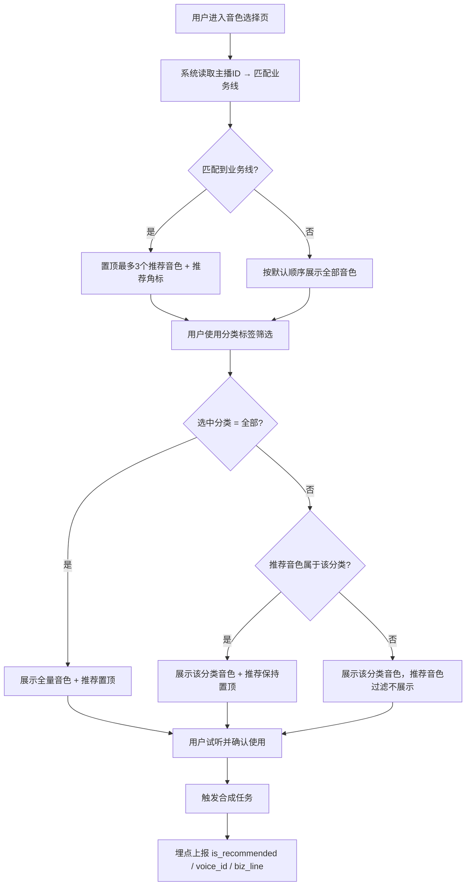

# 【PRD】数字人音色推荐与分类标签优化

| N1 - 需求基本信息 |  |  |  |  |  |
| --- | --- | --- | --- | --- | --- |
| 起草日期 | 2026-XX-XX | 当前PRD版本 | V1.0 | 需求来源 | 数字人团队 |
| 评审日期 | 2026-XX-XX | 技术评审日期 | 2026-XX-XX | 需求类别 | 体验优化 / 推荐算法 需求管理系统 设计稿 AB实验 技术文档 |
| 其他相关文档 | 音色评估报告 V2（内部文档） |  |  |  |  |
| 排期 | （待补充） |  |  |  |  |
| 埋点文档 | （待补充） |  |  |  | <strong>N2 - 人员信息</strong> |
| PM | 前端 | 算法 | 算法工程 | 后端 | QA |
| PM | 前端工程师 | 算法工程师 | 算法工程 | 后端工程师 | 测试工程师 <strong>N3 - 需求变更记录</strong> 暂无变更 |

<strong>一句话摘要</strong>：针对数字人智播平台音色选择效率低、标签体系与业务场景脱节的问题，通过「推荐音色置顶 + 分类标签重构」两项优化，帮助用户快速找到匹配自身业务场景的音色，提升音色配置效率与推荐采纳率。

# 一、需求背景

数字人智播平台支持用户为直播间配置音色（主播声音），目前音色选择页面存在两个核心痛点：

<strong>问题一：缺少个性化推荐，用户选择成本高。</strong>
音色库已积累数十个音色，全量平铺展示，用户需逐一试听才能找到合适音色。不同业务线（如外卖、医美、宠物等）对音色特质的需求差异显著，但当前系统不感知业务场景，无法提供有针对性的推荐。

<strong>问题二：分类标签体系老旧，筛选效率低。</strong>
现有音色分类标签（如「柔声细语」「可爱甜美」「成熟御姐」）基于声线气质划分，颗粒度细碎，无法反映业务场景匹配关系，用户难以通过标签快速定位适合自己业务的音色。

本次需求基于声学分析和业务线匹配策略，对音色选择页进行两项优化：①为匹配到业务线的用户提供推荐音色置顶展示；②重建音色分类标签体系，替换为与业务场景强相关的6大类型。同时配套埋点，支撑推荐采纳率指标的后续追踪。

音色推荐匹配策略详见内部文档《音色评估报告 V2》第五章「全业务线音色推荐表」。

---

# 二、需求目标

<strong>核心目标</strong>：通过推荐置顶和标签重构，降低用户音色选择成本，提升音色与业务场景的匹配效率。

| 指标名称 | 类型 | 目标值 | 指标说明 |
| --- | --- | --- | --- |
| 推荐采纳率 | 核心目标指标 | 上线后3周 ≥ 30% | 有推荐可展示的用户中，最终使用推荐音色触发合成的占比 |
| 音色选择时长（均值） | 辅助指标 | 较上线前下降 ≥ 20% | 衡量用户找到合适音色的效率提升 |
| 分类标签使用率 | 辅助指标 | ≥ 40% 的配置行为经标签筛选 | 验证新标签体系的可用性与吸引力 |

---

# 三、需求方案

### 1）更新日志

| 版本 | 日期 | 更新内容 | 更新人 |
| --- | --- | --- | --- |
| V1.0 | 2026-04-15 | 初稿，完成推荐置顶 + 标签重构方案 | PM |

### 2）需求列表

| # | 需求模块 | 优先级 | 说明 |
| --- | --- | --- | --- |
| 1 | 推荐音色置顶展示 | P0 | 根据主播业务线，在音色列表顶部置顶最多3个推荐音色，带「推荐」角标；未匹配业务线则不展示推荐 |
| 2 | 音色分类标签重构 | P0 | 替换旧气质标签为6大业务场景类型，支持单选筛选；选中分类后仅展示该分类音色 |
| 3 | 推荐采纳率埋点 | P1 | 合成触发时上报音色是否为推荐音色，支撑后续指标分析 |

### 3）需求详情

<em><strong>Nocode链接：</strong></em>

问题反馈

服务加载中...

| 系统 | 页面位置 | 需求说明 | 原型图 |
| --- | --- | --- | --- |
| 智播平台 | 声音配置页 | <strong>推荐音色置顶展示</strong> <strong>触发条件</strong>：用户进入音色选择页时，系统通过主播 ID 读取关联业务线，若匹配成功则展示推荐音色。 <strong>展示规则</strong>： - 按业务线匹配策略（参见内部文档《音色评估报告 V2》第五章「全业务线音色推荐表」），取推荐音色1→2→3，按优先级顺序置顶排列在音色列表最前 - 推荐音色带「推荐」角标，与普通音色卡样式一致，无独立分区标题或分隔线 <strong>降级规则</strong>： - 若推荐音色中有已下架音色，跳过不展示，不补位（剩余几个展示几个） - 商业化过滤：仅展示当前套餐内可用的推荐音色 - 若未匹配到业务线，按默认顺序展示全量音色，不显示推荐角标 <strong>约束</strong>： - 一个主播账号仅关联一条业务线 - 推荐逻辑由后端根据映射表实现，前端只接收「推荐音色ID有序列表」并渲染 |  |
| 智播平台 | 声音配置页 | <strong>音色分类标签重构</strong> <strong>标签体系</strong>（共7项，固定枚举值）： - 全部（默认选中） - 活力促销型 - 专业稳重型 - 亲和甜美型 - 地域特色型 - 艺术品质型 - 平稳实用型 <strong>标签展示位置</strong>：音色卡片右上角（替换原有标签） <strong>旧标签处理</strong>：原有「柔声细语」「可爱甜美」「成熟御姐」等标签全量删除，不保留 <strong>筛选逻辑</strong>： - 单选，默认「全部」 - 选中某分类后，仅展示属于该分类的音色，不属于该分类的音色（包括推荐音色）全部过滤不展示 - 选「全部」时恢复展示全量音色，推荐音色恢复置顶 - 每个音色仅属于一个分类 <strong>推荐与筛选的交互关系</strong>： - 「全部」模式：推荐音色置顶显示 - 选中某分类后：若推荐音色属于该分类，仍保持置顶+推荐角标；若推荐音色不属于该分类，从列表中过滤掉（不展示） <strong>空分类处理</strong>：若当前分类下无音色，列表区显示「暂无相关音色」 | - |

---

# 四、核心流程图

---

# 五、数据埋点

<strong>推荐采纳率埋点</strong>

<strong>埋点时机</strong>：用户确认使用某音色触发合成任务时上报

<strong>埋点字段</strong>：
- `is_recommended`：bool，当前使用的音色是否为推荐音色（true / false）
- `voice_id`：string，音色ID
- `biz_line`：string，主播关联的业务线

<strong>指标定义</strong>：
- 推荐采纳率 = 使用了推荐音色触发合成的次数 / 有推荐音色可展示的用户触发合成的总次数
- 分母口径：仅统计成功匹配业务线、有推荐音色可展示的用户

<strong>看板</strong>：本期暂不接入数据看板，埋点先埋，后续按需查询分析

---

# 六、验收标准

| # | 验收模块 | 验收标准 | 优先级 |
| --- | --- | --- | --- |
| 1 | 推荐置顶-有业务线 | 已关联业务线的主播进入音色页，推荐音色出现在列表最前，数量 ≤ 3，均带「推荐」角标 | P0 |
| 2 | 推荐置顶-无业务线 | 未关联业务线的主播进入音色页，无「推荐」角标，列表按默认顺序展示 | P0 |
| 3 | 推荐降级-下架音色 | 推荐列表中含已下架音色时，下架项不展示、不补位，其余推荐正常置顶 | P0 |
| 4 | 标签-全部 | 默认选中「全部」，展示全量音色，推荐音色置顶；旧气质标签（如「柔声细语」）不再出现 | P0 |
| 5 | 标签-分类筛选 | 点击任意分类标签，仅展示该分类音色；推荐音色若属于该分类保持置顶，否则过滤不展示 | P0 |
| 6 | 标签-空分类 | 某分类下无音色时，列表区显示「暂无相关音色」 | P1 |
| 7 | 埋点 | 触发合成任务时，埋点正常上报 is_recommended、voice_id、biz_line 三个字段，且 is_recommended 值与实际推荐状态一致 | P1 |
